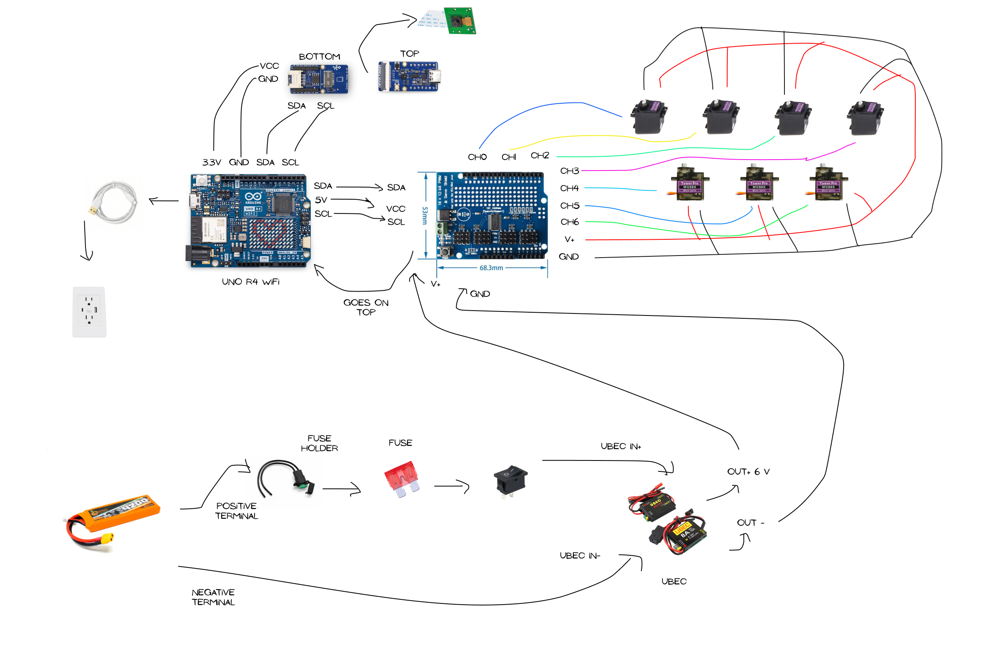

# kivo

6-dof pick-and-place robotic arm using on-device vision, inverse kinematics, and servo control

## demo

not yet, need to build still...

## how it works

- detects objects with the grove vision ai module v2 with yolo running on it
- sends detection data to the arduino uno r4 wifi which calculates joint positions with inverse kinematics then controls 6 joints + holder using a 16-channel servo driver for pwm control
- servo power rail is run separate from the logic side

## architecture

kivo is split into 3 layers

| layer      | hardware                                  | job                                    |
| ---------- | ----------------------------------------- | -------------------------------------- |
| perception | grove vision ai module v2 + ov5647        | object detection + target location     |
| control    | arduino uno r4 wifi                       | inverse kinematics + motion sequencing |
| actuation  | 16-ch servo driver + 4× mg996r + 3× mg90s | moves the arm + holder                 |

### wiring

## cad

final 3d mockup

|                                   |                                   |                                   |
| --------------------------------- | --------------------------------- | --------------------------------- |
|  |  |  |

stl files are in [`cad`](cad)

## bom

full parts list is in [`bom.csv`](bom.csv)
