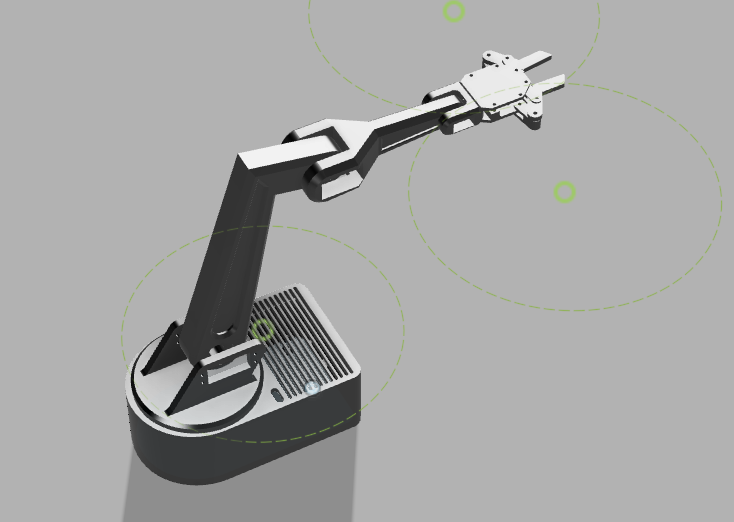
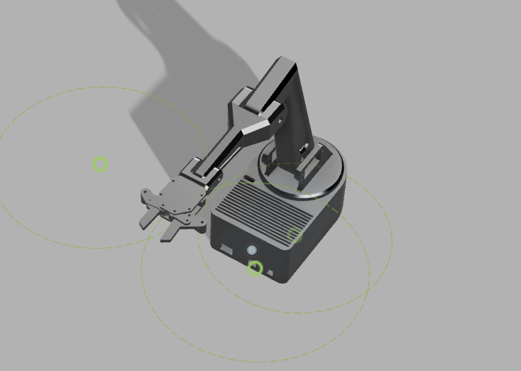
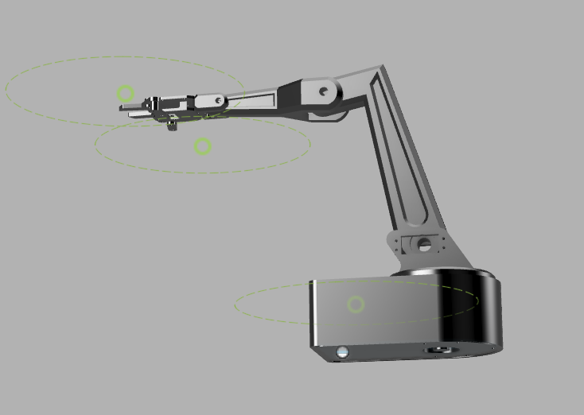

# kivo

arduino uno q powered 6 dof pick and place robotic arm

## CAD

this is the final 3d mockup of the arm.

|                                 |                                 |                                 |
| ------------------------------- | ------------------------------- | ------------------------------- |
|  |  |  |

stl files are in the `CAD` folder.

## BOM

click [here](bom.csv) to view the bill of materials.
